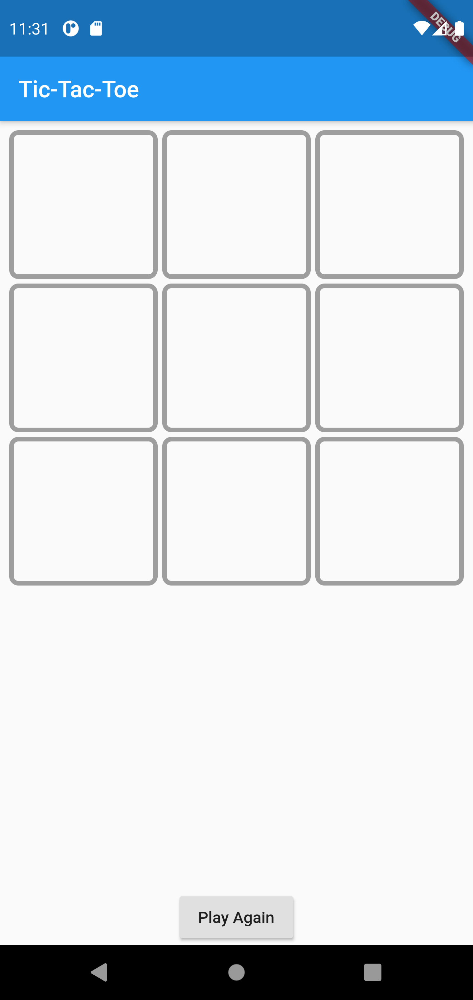
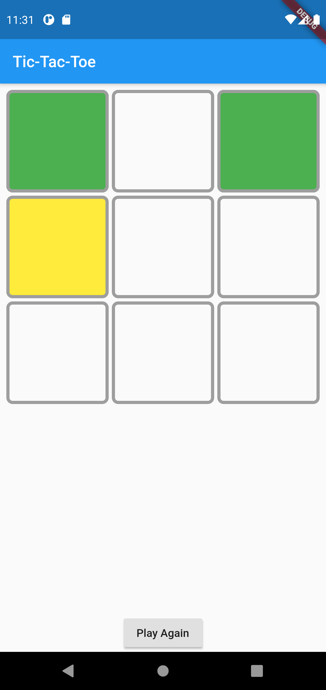
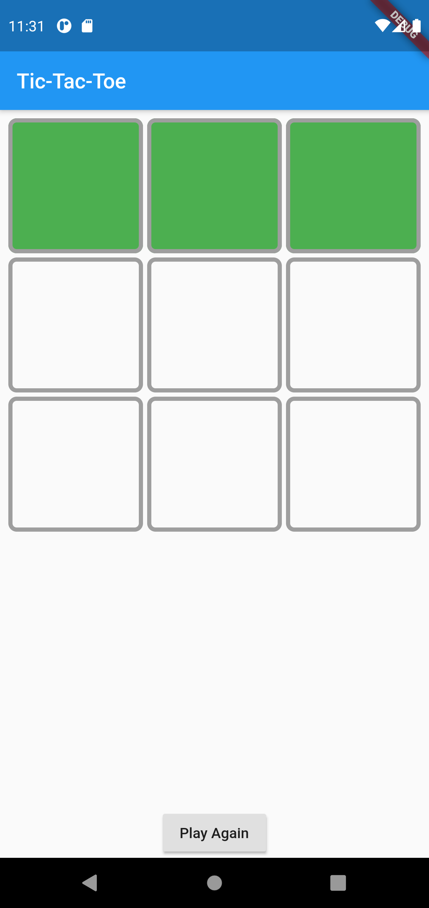

# tic_tac_toe

A simple game of tic-tac-toe

# Quick links

1. [Features](#features)
2. [Screenshots](#screenshots)
3. [Getting Started](#getting-started)
4. [Questions](#questions)
5. [Other Resources](#other-resources)

## Features

1. Play again button
2. When someone wins, the opponent color will disappear

## Screenshots

<p>
 
 
 
</p>

## Getting Started

#### 1. [Setup Flutter](https://flutter.io/setup/)

#### 2. Clone the repo

```sh
$ git clone https://github.com/Zubii12/tic_tac_toe
$ cd tic_tac_toe/
```

## Questions?🤔

Hit me on

<a href="https://www.linkedin.com/in/zubii12/"></a>

## Other Resources

A few resources to get you started if this is your first Flutter project:

- [Lab: Write your first Flutter app](https://flutter.dev/docs/get-started/codelab)
- [Cookbook: Useful Flutter samples](https://flutter.dev/docs/cookbook)

For help getting started with Flutter, view our
[online documentation](https://flutter.dev/docs), which offers tutorials, samples, guidance on mobile development, and a
full API reference.
